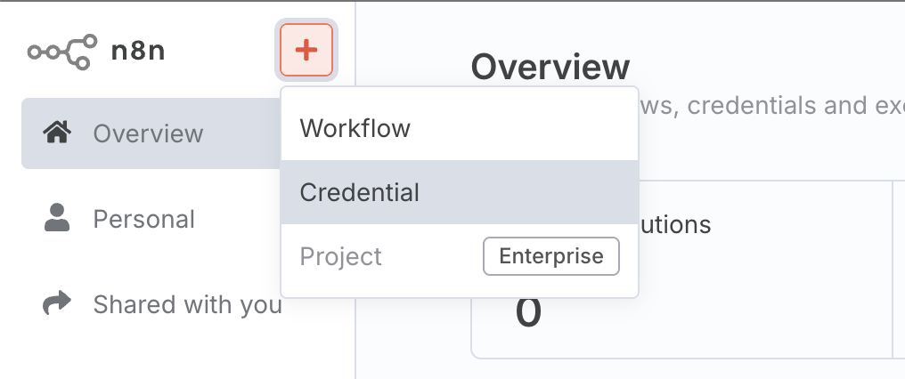
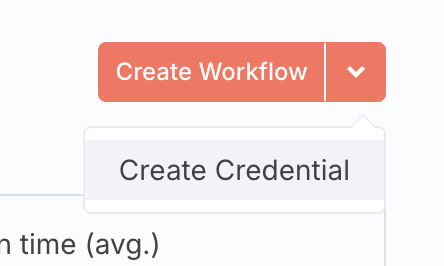
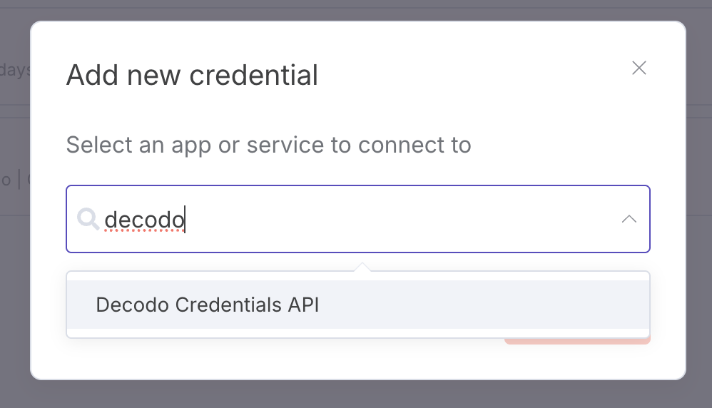
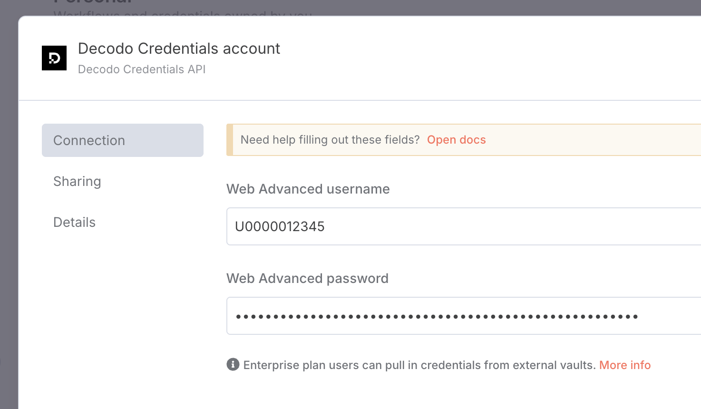

# n8n-nodes-decodo

This repo contains the source code for integrating [Decodo's Scraper API](https://decodo.com/scraping) with [n8n](https://n8n.io).

[n8n](https://n8n.io/) is a [fair-code licensed](https://docs.n8n.io/reference/license/) workflow automation platform.

## Installation

Follow the [installation guide](https://docs.n8n.io/integrations/community-nodes/installation/) in the n8n community nodes documentation.

## Operations

The node supports scraping the contents of a target URL using Decodo's Scraper API, which automcatically circumvents blocks and bot protection.

## Credentials

The node required a Decodo Scraper API Web Advanced subscription. Free trials available in [dashboard](https://dashboard.decodo.com/).

Once you have a scraping account username and password:

1. Open the credentials window on n8:

2. Create a new credential:

3. Find the Decodo Scraper API:

4. Fill in your username and password

After filling in your credentials, you can test your node in one of the ways below:

- Using the node as a tool, filling in a sample URL and running "Execute step".
- Wiring up an AI agent and sending a propm with a target website, such as `scrape nba's wikipedia page`.

## Compatibility

Node has been developed and tested with:

- Node.js v22.17.0
- n8n nodes API version 1
- [n8n-workflow](https://www.npmjs.com/package/n8n-workflow) v1.82.0

## Resources

- [n8n community nodes documentation](https://docs.n8n.io/integrations/#community-nodes)
- [Decodo Scraper API documentation](https://help.decodo.com/docs/web-scraping-api-introduction)
