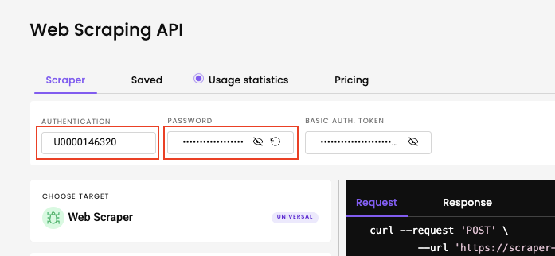
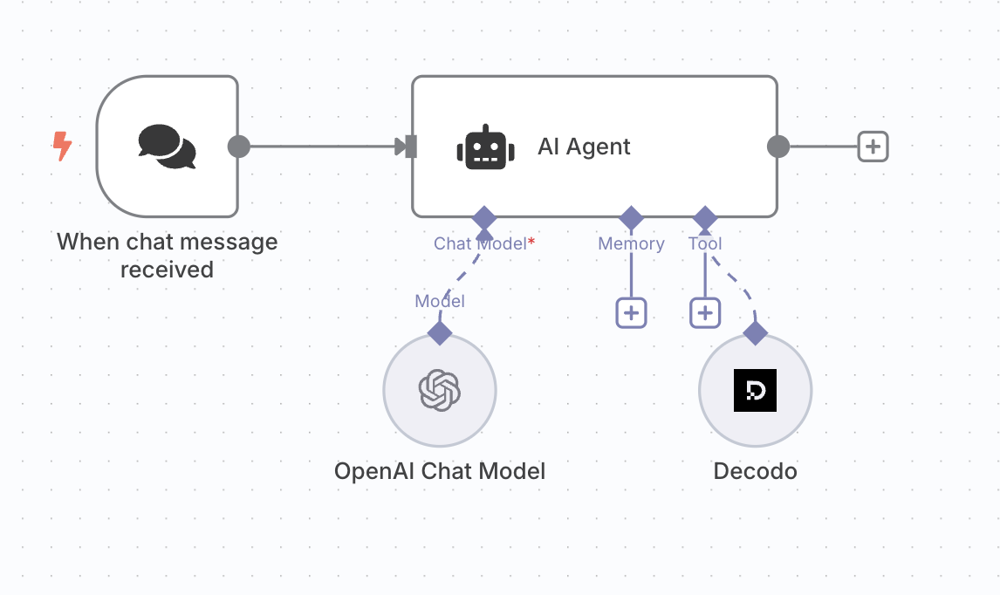

# n8n-nodes-decodo

This repo contains the source code for integrating [Decodo's Scraper API](https://decodo.com/scraping) with [n8n](https://n8n.io). The node supports scraping the contents of a target URL using Scraper API, which automcatically circumvents website blocks and bot protection.

[n8n](https://n8n.io/) is a [fair-code licensed](https://docs.n8n.io/reference/license/) workflow automation platform.

## Installation

Follow the [installation guide](https://docs.n8n.io/integrations/community-nodes/installation/) in the n8n community nodes documentation.

## How to use

1. Obtain a Decodo Scraper API Web Advanced plan.

2. Fill in Decodo credentials in n8n (see below).

3. Start using the node.

## Obtaining a Decodo account

The node requires a Decodo Scraper API Web Advanced plan. Free trials available in [dashboard](https://dashboard.decodo.com/).

Once you have a plan activated, take a note of your generated username and password:



## Seting up credentials on n8n

1. Open the credentials window on n8n:


2. Create a new credential:


3. Find the Decodo Credentials API:


4. Fill in your username and password


## Using the node

The node is intended to be used as a tool for an AI agent. The most simple setup would look like this:



With this setup, you can ask the agent to scrape a website in order to extract information.

As an example, if your AI model does not have access to the most recent web information, the following question may fail:

```
who won nba in 2025?
```

The question can be answered by updating the prompt with an instruction to scrape a reliable source:

```
scrape wikipedia and tell me who won nba in 2025
```

## Compatibility

Node has been developed and tested with:

- Node.js v22.17.0
- n8n nodes API version 1
- [n8n-workflow](https://www.npmjs.com/package/n8n-workflow) v1.82.0

## Resources

- [n8n community nodes documentation](https://docs.n8n.io/integrations/#community-nodes)
- [Decodo Scraper API documentation](https://help.decodo.com/docs/web-scraping-api-introduction)
