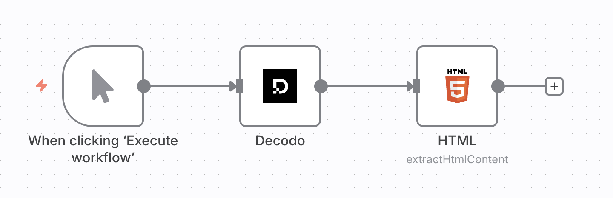

# Decodo n8n Node

This repository provides an n8n integration for **Decodo's  Web Scraping API**, a powerful web scraping tool that automatically bypasses blocks and bot protection to extract data from any target URL. It's designed for developers and startups looking to automate data collection workflows from platforms like Google, eCommerce sites, and job boards.

[n8n](https://n8n.io/) is a [fair-code licensed](https://docs.n8n.io/reference/license/) workflow automation platform that lets you connect apps, APIs, and services to build automated workflows with minimal effort.

## Features
- **Easy integration**. Plug the Decodo's n8n node into existing workflows to start scraping with minimal setup.
- **Bypassing CAPTCHAs, rate-limits, and IP bans**. Automatic handling of common anti-bot defenses.
- **Geo-targeting**. Request region-specific results from websites that restrict content based on location.
- **Rotating proxy support to avoid IP bans**. Built-in proxy rotation to keep requests distributed and persistent.
- **Structured data output**. Get results in JSON or Markdown formats for easy readability and further analysis.

## Installation
Decodo is an official node integrated into n8n. To use it, simply:
1. Open the nodes panel.


2. Search for "Decodo" to find the node.


3. Click **+ Add to workflow**.


### Obtaining a Decodo account

The node requires a [Decodo Web Scraping API](https://decodo.com/scraping) Advanced plan. You can get started with a free trial on the [dashboard](https://dashboard.decodo.com/).

Once you have a plan activated, take a note of your generated authentication token from the [Web Scraping API page](https://dashboard.decodo.com/web-scraping-api/scraper):


### Setting up credentials on n8n

1. Open the credentials window on n8n.


2. Create a new credential.


3. Find the *Decodo Credentials API*.


4. Enter your authentication token.


## Using the node
The node can be used in 2 ways - as an individual HTTP request node, or a tool for an AI agent.

### Individual node
To use the Decodo node by itself, connect it to an existing workflow. Once you add it, you can set the target **URL** and **Geolocation**.


The node requests the target URL through a proxy in the chosen location, scrapes the page, and returns the response for use by downstream nodes such as the **HTML** node to extract content. Below is an example setup:



### AI agent tool

You can connect the Decodo node to the AI Agent node as a tool. You don't need to modify anything inside the node. Here's what a simple setup would look like:


With this setup, you can prompt the agent to scrape a website in order to extract information. The prompt must be detailed and specific to return the best results.

**Bad prompt example**

If your AI model does not have access to the most recent web information, the following question may fail:

```
Who won the NBA in 2025?
```

**Good prompt example**

The question is more likely to be answered by updating the prompt with an instruction to scrape a reliable source:

```
Scrape Wikipedia and tell me who won the NBA in 2025.
```

## Parameters

When used as an AI tool, the following parameters are inferred automatically from messages:

| Parameter | Description                           				 | Example message                                                                         |
| --------- | -----------------------------------------------| --------------------------------------------------------------------------------------- |
| `url`     | The target URL to scrape              				 | Scrape Wikipedia and tell me the article of the day.                                    |
| `geo` | The country name from which to scrape | Scrape https://ip.decodo.com/json and tell me what city the request originated from. |
| `markdown`| Receive Markdown type responce instead of HTML | Scrape https://ip.decodo.com/json and return result in markdown format.                 |

If used as an individual node, these parameters can be manually configured by double-clicking on the node. 

## Development & releases

### Contribution
To contribute to this node:

1. Install n8n globally in your development machine.
2. Pull this repository.
```
git clone https://github.com/Decodo/n8n-nodes-decodo.git

```
3. Navigate to the downloaded folder and build it.
```
cd n8n-nodes-decodo
npm install
npm run build
```
4. Inside the project folder, run `npm link` after building to make your local build of `@decodo/n8n-nodes-decodo` available in the local npm registry.
5. Inside `~/.n8n/nodes/node_modules/`, run `npm link @decodo/n8n-nodes-decodo`.

See this [documentation page](https://docs.n8n.io/integrations/creating-nodes/test/run-node-locally) for more information.

### Automated releases

This project uses automated releases via GitHub Actions and semantic-release. When code is merged into the `main` branch, the following happens automatically:

1. **Semantic analysis**. Commit messages are analyzed to determine the type of release (patch, minor, major).
2. **Version bump**. The version in `package.json` is automatically updated.
3. **NPM publish**. The package is built and published to npm as `@decodo/n8n-nodes-decodo`.
4. **GitHub release**. A GitHub release is created with automatically generated release notes.
5. **Git tag**. A git tag is created for the new version.

### Required secrets

For automated releases to work, the following GitHub repository secrets must be configured:

- `NPM_TOKEN`. An npm access token with publish permissions for the `@decodo` organization.
- `GITHUB_TOKEN`. Automatically provided by GitHub Actions (no setup required).

### Commit message format

To trigger releases, use conventional commit messages:

- `feat: new feature` → Minor version bump
- `fix: bug fix` → Patch version bump
- `feat!: breaking change` or `BREAKING CHANGE:` in footer → Major version bump
- `docs:`, `style:`, `refactor:`, `test:`, `chore:` → No release

## Compatibility

The Decodo node has been developed and tested with:

- Node.js v22.17.0
- n8n nodes API version 1
- [n8n-workflow](https://www.npmjs.com/package/n8n-workflow) v1.82.0

## Resources

- [n8n community nodes documentation](https://docs.n8n.io/integrations/#community-nodes)
- [Decodo Scraper API documentation](https://help.decodo.com/docs/web-scraping-api-introduction)

## Further reading
- [Complete guide for building n8n web scraping automations](https://decodo.com/blog/n8n-web-scraping-automation)
